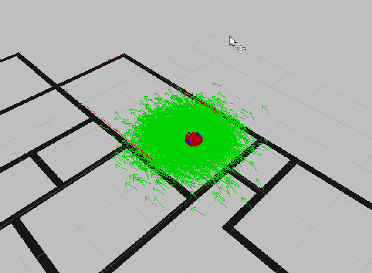
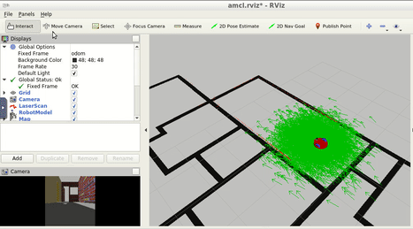

# Project 3 - Where Am I?

This repo contains the third project of the Robotics Software Engineer Nanodegree Program from Udacity. The program shows a robot which can perform Adaptive Monte Carlo Localization (AMCL). Also, the robot can navigate to a goal in the map.

The image below shows the environment in rviz.

## Dependencies for Running
* cmake >= 3.5.1
  * Linux: [click here for installation instructions](https://cmake.org/install/)
* make >= 4.1 (Linux, Mac)
  * Linux: make is installed by default on most Linux distros
* gcc/g++ >= 5.4
  * Linux: gcc / g++ is installed by default on most Linux distros
* gazebo simulator >= 11.0.0
  * Linux: [gazebo download](http://gazebosim.org/download)
* ROS >= Kinetic
  *  Linux: [Ubuntu install of ROS Noetic](http://wiki.ros.org/kinetic/Installation/Ubuntu)

## Basic Running Instructions

1. Clone this repo.
2. Open top level directory: `cd RobotND-WhereAmI/catkin_ws`
3. Build the files: `catkin_make`
4. Execute in terminal: `source devel/setup.bash`
5. In terminal, launch the simulation environment (Gazebo and Rviz): `roslaunch my_robot world.launch`
6. In a new terminal, launch Monte Carlo Localization: `roslaunch my_robot amcl.launch`
7. In Rviz, with 2D Nav Goal select a point to navigate.
